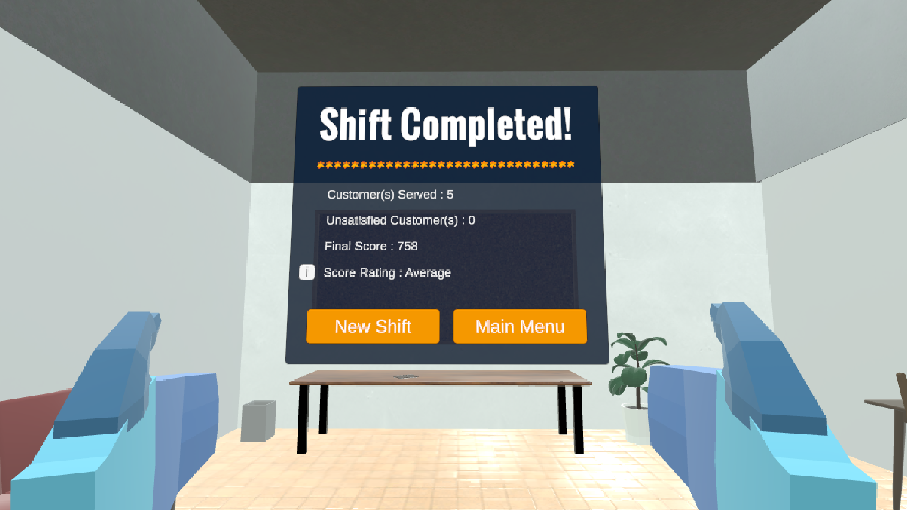

# Friend Mart Simulator
*Friend Mart Simulator*, a VR game that simulates a realistic and immersive working environment in a convenience store.

## Overview
The VR application is developed by a group of 3 members under the course BMCS3063 Virtual Reality. The project aims to simulate the core responsibilities of working in a convenience store, *Friend mart* through natural VR interactions. Players will experience the full workflow of a typical shift in this lively store.

## Feature
- **Immersive checkout system** - From item scanning and bagging until payment processing and pickup, the system is designed to mimic a real convenience store workflow.
- **Dynamic and realistic working environment** - The store simulates a typical convenience mart setting, where players start and end their shift, and customers shop around the store.
- **Scoring system** - Player is evaluated based on service speed during the shift, providing insights into their performance.

## Role
I served as the **project lead** and was responsible for the core gameplay programming and system integration. My contributions included:

- **Gameplay mechanics** – Designed and implemented the main gameplay loop and player interactions.
- **Checkout system** – Developed the full cashier workflow, including item scanning, bagging, payment handling and item pickup logic.
- **Customer system** – Implemented customer behaviors such as wandering, item grabbing and queueing at the checkout counter.
- **Scoring system** – Built a performance evaluation system based on service speed.
- **System integration** – Combined all mechanics, assets and UI elements into the final playable build.

My two teammates contributed as the **scene designer** and **UI designer**, covering environment design, 3D assets, UI layouts, visual elements, spatial audio and overall presentation.

## Technology
- **Unity** – Core game engine used for developing VR interactions, gameplay logic and environment setup.
- **C#** – Primary programming language for gameplay mechanics, systems and AI behavior.
- **Oculus Integration & XR Interaction Toolkit** – Used for VR controllers, interactions, hand tracking and VR rig setup.
- **Microsoft Visual Studio** – IDE used for scripting and debugging.

## Screenshot

  
   
  Main menu for <em>Friend Mart Simulator</em>.
    
  
  
   
  The staff room in <em>Friend Mart</em>, where players start and end thier shift, and review their performance after the shift.
    
  
  
   
  The environent of <em>Friend Mart</em>, sweet and clean.
    
  
  
   
  The ongoing shift. The customers are queuing up, and the player is holding the scanner, ready for the checkout.
    
  
  
   
  The interface after completing the shift.

